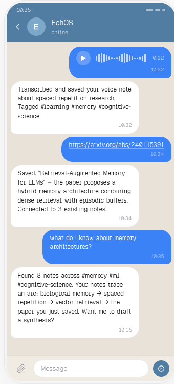

<div align="center">


# EchOS

**Your personal AI knowledge system — self-hosted, agent-driven, and always private.**

[](LICENSE)
[](https://nodejs.org)
[](https://www.typescriptlang.org)
[](https://github.com/albinotonnina/echos/releases)

**[→ Full documentation at docs.echos.sh](https://docs.echos.sh)**

</div>

---

> [!NOTE]
> EchOS is a personal project — built for one user, deployed on your own infrastructure. It is intentionally not multi-tenant.

<div align="center">



*Save articles, search your knowledge, get reminders — all through natural conversation.*

<a href="https://www.youtube.com/watch?v=D3QCQXqNewU">
  Youtube DEMO<br />
  
</a>

<br/>

</div>

---

## What it feels like

You're walking and a thought hits. You open Telegram and say it out loud. Thirty seconds later it's in your knowledge base — transcribed, categorized, tagged, searchable. You didn't open an app. You didn't fill a form. You didn't think about where to put it.

That's the thing EchOS is trying to solve. Not the storage. The friction.

```
You:    Save this for me → [pastes article URL]
EchOS:  Saved. "How Rust handles memory safety" — tagged as rust, programming.
        I pulled the key points if you want a summary.

You:    What do I know about memory management?
EchOS:  Found 7 notes. The Rust piece you just saved, two older ones on GC pauses,
        a voice note from last Tuesday where you were ranting about malloc...

You:    Write a short post about it — my style, technical but readable
EchOS:  [drafts a post grounded in your actual notes, in your voice]

You:    Save it.
EchOS:  Done. You can open it in Obsidian whenever you want.
```

No commands to memorize. No schemas to design. No dashboards to maintain.

---

## Why self-hosted

Your notes are yours. They live on your server, in plain Markdown files you can open in Obsidian right now. No subscription. No sync fees. No vendor deciding what to do with your thinking.

The only outbound calls are to the AI APIs you configure — and only when you ask it to do something.

---

## The main things it does

**Capture without friction.** Text, URLs, voice messages, photos — through Telegram, the terminal, or the web. It figures out what to do with them.

**Search that actually understands you.** Not keyword matching. Hybrid full-text and semantic search: ask it a question the way you'd ask a person, and it finds what you meant.

**Write in your voice.** Tell it to write a blog post, a thread, an email. It reads your notes for source material and matches the way you actually write — not generic AI prose.

**Obsidian-compatible, always.** Every note is a plain `.md` file. Open `$ECHOS_HOME/knowledge` (default: `~/echos/knowledge`) in Obsidian and your entire knowledge base is right there. Live sync, bidirectional.

**Remembers how you want it to talk.** Tell it to be concise, warmer, more technical. It adapts immediately and stays that way.

---

## How EchOS Compares

| Feature | EchOS | Obsidian + AI | Notion AI | Mem | Apple Notes |
|---|:---:|:---:|:---:|:---:|:---:|
| Runs locally | ✓ | ✓ | ✗ | ✗ | ✗ |
| Local storage | ✓ | ✓ | ✗ | ✗ | ~ |
| Agent-driven | ✓ | ✗ | ✗ | ~ | ✗ |
| Telegram interface | ✓ | ✗ | ✗ | ✗ | ✗ |
| CLI | ✓ | ~ | ✗ | ✗ | ✗ |
| Plugin system | ✓ | ✓ | ~ | ✗ | ✗ |
| Semantic search | ✓ | ~ | ~ | ✓ | ✗ |
| Knowledge graph | ~ | ✓ | ✗ | ✗ | ✗ |
| MCP server | ✗ | ~ | ✗ | ✗ | ✗ |
| Voice input | ✓ | ~ | ✗ | ✗ | ~ |
| Content capture (URL/YouTube) | ✓ | ~ | ~ | ~ | ~ |
| Plain markdown files | ✓ | ✓ | ✗ | ✗ | ✗ |
| Obsidian compatible | ✓ | ✓ | ✗ | ✗ | ✗ |

~ = partial support via plugins or workarounds

**Choose Obsidian + AI plugins** if you want a mature, polished UI with a large plugin ecosystem and you're happy to configure things yourself. EchOS trades Obsidian's graph view and rich editor for a conversational agent that captures and organizes for you automatically.

**Choose Notion AI** if you need team collaboration, structured databases, and don't mind cloud storage. EchOS is intentionally single-user and keeps everything local.

**Choose Mem** if you want zero-setup, cloud-native AI notes without any self-hosting. EchOS requires a server but gives you full data ownership in return.

**Choose Apple Notes** if you're deep in the Apple ecosystem and want something that just works without any configuration. EchOS is for people who want a programmable, AI-driven knowledge layer they fully control.

---

## Get started

**macOS (Homebrew)**

```bash
brew tap albinotonnina/echos
brew update
brew install echos
echos-setup          # browser-based setup wizard
brew services start echos
```

**One-liner (macOS + Linux)**

```bash
curl -sSL https://raw.githubusercontent.com/albinotonnina/echos/main/install.sh | bash
```

**Manual**

```bash
git clone https://github.com/albinotonnina/echos.git && cd echos
pnpm install && pnpm build
pnpm wizard         # opens http://localhost:3456 with guided setup
pnpm start
```

You'll need an LLM API key — either Anthropic (`ANTHROPIC_API_KEY`, pay-as-you-go, not a Claude subscription) or any other provider supported by pi-ai (`LLM_API_KEY`). Custom OpenAI-compatible endpoints (DeepInfra, local Ollama, etc.) are supported via `LLM_BASE_URL`. Everything else is optional.

**[→ Full setup guide at docs.echos.sh/distribution](https://docs.echos.sh/distribution)**

---

## Documentation

Everything you need to go deeper is at **[docs.echos.sh](https://docs.echos.sh)**.

| | |
|---|---|
| [Architecture](https://docs.echos.sh/architecture) | How the pieces fit together |
| [Deployment](https://docs.echos.sh/deployment) | VPS, Docker, nginx, systemd |
| [Security](https://docs.echos.sh/security) | What EchOS does and doesn't do with your data |
| [Knowledge Import](https://docs.echos.sh/knowledge-import) | Bring in your Obsidian vault or Notion export |
| [Writing](https://docs.echos.sh/writing) | Voice profiles and content generation |
| [Plugins](https://docs.echos.sh/plugins) | YouTube, articles, and building your own |
| [Troubleshooting](https://docs.echos.sh/troubleshooting) | When things go sideways |

---

## License

MIT
